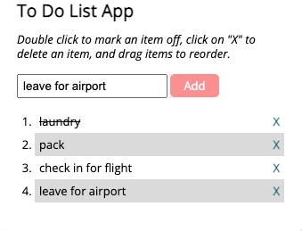

# to-do-list-app

A simple to-do-list app built with jQuery.

  

# Key Features
* Type to-do item into text box; Add to list by pressing enter
* Mark as completed by pressing __
* Delete task by clicking 'x'

# Technologies
* HTML
* CSS
* Javascript
* jQuery
